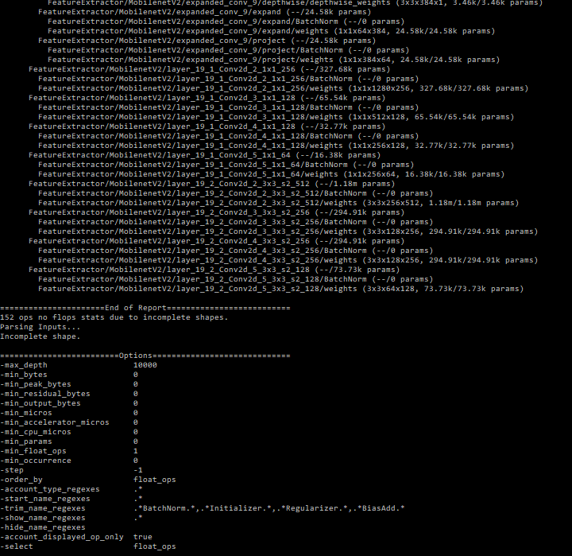

Summary : FINAL PROJECT REPORT 
Id : gun and knife identification in images 
Categories : CNN, Object Detection, Images, Scraping,Trigger, Flask, YOLO, SSD, Faster R-CNN
Environments :js 
Status : Draft
feedback link :github.com/Dharani-Thirumalaisamy
analytics account :0

# CSYE 7374 : FINAL PROJECT REPORT

## Project Topic
<b>Gun and Knife Identification In Images</b>

## Authors
* <b> Dharani Thirumalaisamy </b>
* <b> Pramod Nagare </b> 
 
## Objective 

As we know we humans are very good at detecting and identifying different objects in an image. 
Our visual system is very fast and accurate with complex tasks like detecting objects and identifying obstacles, 
which leads us to take several actions like run, walk, talk, jump, etc. 
But when it comes to perform the same using Artificial Intelligence technique it becomes very tough. 
The perform of autonomous driving cars, robotics, tracking object, face detections and many more applications, 
depends on the object detection algorithm it is based on. As object detection serves the base for such innovative and 
vast range of applications, we as a students of cognitive computing class would like to work on object detection in an image.

## Dataset 
We have readily available dataset for knife images from :
[Download Knives](http://kt.agh.edu.pl/matiolanski/KnivesImagesDatabase/) 

Also, we have images of different categories of guns :
[Download Guns](http://www.imfdb.org/wiki/Category:Gun)

To get more models and shapes of knife, we used falcon :
[Download Falcon Extension](https://chrome.google.com/webstore/detail/falconio/jkebldamonadkdoliopafdngmkjmciie?hl=en)

Knife and Guns images were scraped from the above two sites. 

## Flowchart

Description:
* User accesses flask application from his browser.
* User uploads image through flask application to detect knife or gun.
* Then the image will access a EC2 instance on which flask application is running. 
  This in turn calls the object detection model that is running in the back-end of the application.
* If any gun or knife is detected in an image, using IAM RDE, EC2 instance will publish a SNS message which will trigger an AWS lambda function
  which eventually triggers an email to the server side user.
* Also the image detected in the image will be reported back to the user.

## Data Scraping 
* Libraries Imported for web scraping :

These are the libraries that were used to scrape the images from the website. 

* Parsing the URL of guns website. 
There are 24 different categories of gun. So the code will loop through all those categories to scrape all the images. 

* In this the knife URL is passed and the .rar file is extracted and stored in a local directory.

* The images that was scraped different height and width. So in order to make height and width the same these lines of code had to be run. 
Here every image’s height and width is made 200x200 for uniformity. 

After the images are extracted, the next step is to pass it through an object detection network. 
There are many networks that can be worked on :

<b>
* Sliding window
* R-CNN
* Fast R-CNN
* Faster R-CNN
* Single Shot Detector
* YOLO(Yolo9000, Yolov2,Yolov3)
* MobileNet
* Inception Network
* AlexNet
</b>

Every network listed above can be implemented from scratch, but due to time constraint and computational complexity, we have done transfer learning in our project. 
So for every network that we tried, we ran the official architecture on our custom dataset(knife and gun) for the pre-trained weights and configuration( which was altered for our need) and got the weights for our dataset on which the images/video was trained. 

The architectures that we chose are :
<b>
* Yolov2 
* SSD on mobilenet 
* Faster R-CNN on Inceptionv2 
</b>

## Object Detection Using Yolov2

*	Now that we have the images with us, the first step to do is annotation of images. These images should have a boundary box and also labelled for the network to classify them. To do so, there are 2 GUI’s : 
    *	LabelImage Tool box 
    *	BBox Label Tool box
For Yolo, labelImg tool box is used.
(Just run labelImg.py from terminal)

This is what it looks like. 
In ‘Open Dir’ the directory that contains the images should be given and to store the output files, the path can be given in ‘Changes Save Dir’.

In this method, the annotation files should be in .txt format. There is an option to choose YOLO format in this GUI. 

This will give text files for each image of the format :
Label_index , x_min,y_min,x_max,y_max

In our case, Label_Index 0 is Gun and 1 is Knife.

* Once annotations are done for all the images, create a obj.names file with gun and knife in it. 

* Install darknet which is the framework for YOLO. 

* In that darknet, there will be a cfg folder which will have all the weights. 
For this project Yolov2.cfg was used. Copy the contents in that configuration file to another configuration file and 
name it the way u want it with .cfg extension.

* Change the number of filters in the last Convolutional layer to (num_of_classes+5)*5. 
In this case 35 and also change the number of classes in the next layer. 

* Create 2 separate text files named train.txt and test.txt with names of all the training images and testing  images. Copy this into darknet folder. 

* Download the pre-trained weights file for Yolo [download darknet19_448.conv.23](https://pjreddie.com/darknet/yolov2/) from official website. 

* Create 2 other files named obj.data with details about where the test, train data is stored, about where to save the weights and also form 
where to get information about labels(obj.names) inside cfg folder in darknet. 

The weight file here can be downloaded from [Download Yolo Weights](https://console.cloud.google.com/storage/browser/yoloweights)

* Once all these files are ready, run the following command to train your network for custom dataset and get your weights. 
Run this command from darknet folder :
<b> ./darknet detector train cfg/obj.data cfg/yolo-obj.cfg darknet19_448.conv.23 </b>

Since YOLO architecture is complicated and complex it will take hours to train the model. 
On CPU, it will take years. This model has 100 epochs, with batch size = 64 and subdivisions  = 8 . 
In normal CPU, each epoch takes 30 hours, so for training 100 epochs it would take a long time. 
So I trained my model using NVIDIA titan Graphics Card. It took 3 hours to train the complete network.

Negative
: Unfortunately, the IoU values that we got was very less and loss didn’t decrease. So, the output that we got didn’t predict anything. 

Positive
: With this as the case, we decided to switch to another network , which is SSD_mobilenet. 

## Object Detection Using SSD MobileNet 

Single Shot Detector is another model used for object detection. It is relatively fast to train compared to YOLO. 

Before starting with the implementation, tensorflow environment should be setup properly to execute the files in this model.
For that refer [Tensorflow](https://github.com/EdjeElectronics/TensorFlow-Object-Detection-API-Tutorial-Train-Multiple-Objects-Windows-10#appendix-common-errors)
Once the environment is setup, the model implementation can be done.
 
To implement this :
*	Just like how data annotation is done for YOLO, we need to do annotation in this case too but the only difference Is the format. 
For SSD we .csv format is required. 
*	The same tool box can be used to do the annotation. 
*	The tool box provided only .txt and .xml format. So first do the annotation in .xml format for all the images. 
	Split them into train and test images. Run xml_to_csv.py separately for test and train images to get train_lables.csv and test_labels.csv.
	

This is how annotation xml file looks. 

This is csv file format. 

*	Once this is done, download SSD_mobilenet_v2_coco.cfg from [Download models](https://github.com/tensorflow/models/blob/master/research/object_detection/g3doc/detection_model_zoo.md) 
*	Edit the cfg files. Change the training image path, testing image path, training annotation path, testing annotation path. 
*	Change the number of classes too. 
*	Once all these are done, create a training folder inside which create a .pbtxt file with classes names on it. 
*	Now run this command from the terminal :
<b>python train.py --logtostderr --train_dir=training/ --pipeline_config_path=training/ssd_mobilenet_v2_coco.config
</b>
Training will take some time, but the weights will get saved for every 5 steps.

<b> python export_inference_graph.py --input_type image_tensor 
								 --pipeline_config_path training/ssd_mobilenet_v2_coco.config 
								 --trained_checkpoint_prefix training/model.ckpt-(highest value) 
								 --output_directory inference_graph
</b>

Run this command with the highest value of weight file that Is generated. 

Once this is done , a .pb file will be generated. Now run object_detection_image.py file from python idle and check the output.

Negative
: In this, Knifes are getting detected as knifes but guns are also getting detected as knifes or sometimes not being detected at all. 
  So that is the drawback about this model. 

  
Positive
: To overcome this problem, we tried another network : Faster R-CNN. 

## Object Detection Using Faster R-CNN and Inceptionv2

Faster R-CNN is a one of the method for object detection. Though it is not the state-of-art, it performs very well and also it trains faster than SSD. 

As the training portion of Faster R-CNN is similar to that of SSD, steps a to steps g are the same except for step D. 
In this, instead of downloading SSD weights, [Download models](https://github.com/tensorflow/models/blob/master/research/object_detection/g3doc/detection_model_zoo.md) 

After setting up the environment similar to SSD and following the procedure, train the model using :
<b>python train.py --logtostderr --train_dir=training/ --pipeline_config_path=training/faster_rcnn_inception_v2_pets.config</b>

Just like SSD, weights file will get updated after some steps and run the below command with highest weight file.
<b>python export_inference_graph.py --input_type image_tensor 
									--pipeline_config_path training/ faster_rcnn_inception_v2_pets.config 
									--trained_checkpoint_prefix training/model.ckpt-(highest value) 
									--output_directory inference_graph</b>

Training for a long time decreases loss rate to 0.02 and below.

									
positive
: The output that we got is better than the other two models. So, we will be moving forward with this model as our final one.									

 
 

## Trigger Implementation
Now that we have our best model out of 3, the next part is to trigger an alarm or email or SMS to someone who is monitoring it.
Here, in our project we have implemented email trigger.
So when user inputs an image and if our model detects it as knife or gun, the [lambda function](https://aws.amazon.com/lambda/features/) 
provided by Amazon will get triggered and will send an email to the person in-charge of it. 

For implementing trigger, Amazon's SES service is used. In this we are mentioning that we need to trigger an email based on an event which is detection of 
a gun or a knife. 								

## Flask Application
The important part is that people should be able to upload images or video. In order to accommodate, a flask application is developed to upload images. 

First we are asking the user to input an image. The template for the web page is called from index.html file. 

The image is read in numpy array format which is later converted to image. This image is given as input to ObjectDetection.py file which will detect 
the object in the uploaded image. 

ObjectDetector.py is same as object_detection_image.py that we used in SSD and Faster R-CNN model.
									

## References 
<i>[a][TensorFlow Setup](https://github.com/EdjeElectronics/TensorFlow-Object-Detection-API-Tutorial-Train-Multiple-Objects-Windows-10#appendix-common-errors)
[b][Yolo Reference 1](https://www.arunponnusamy.com/yolo-object-detection-opencv-python.html)
[c][Yolo Reference 2](https://github.com/ManivannanMurugavel/YOLO-Annotation-Tool)
[d][Yolo Reference 3](https://github.com/AlexeyAB/darknet#how-to-train-to-detect-your-custom-objects)
[e][Darknet issues](https://github.com/pjreddie/darknet/issues/382)
[f][Custom Object Detection](https://medium.com/coinmonks/detecting-custom-objects-in-images-video-using-yolo-with-darkflow-1ff119fa002f)
[g][Darknet official](https://pjreddie.com/darknet/)
[h][Darknet Github](https://medium.com/coinmonks/detecting-custom-objects-in-images-video-using-yolo-with-darkflow-1ff119fa002f)
[i][Annotation-Tool](https://github.com/tzutalin/labelImg)</i>

